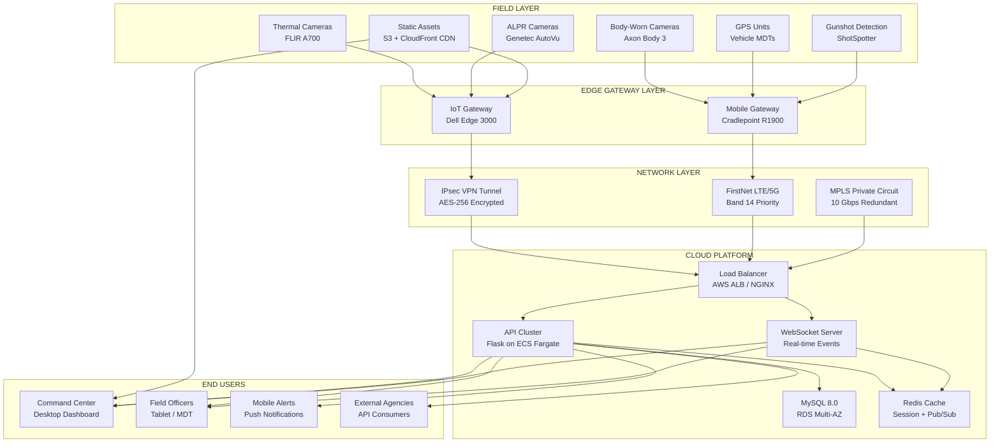
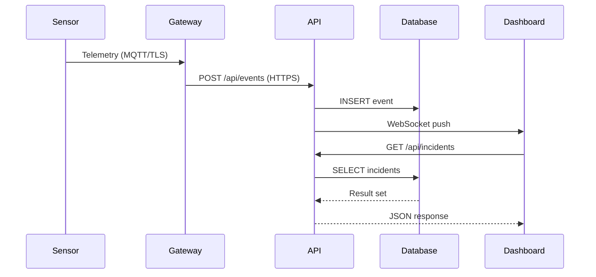
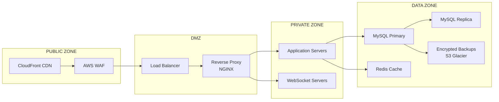

# Network Architecture

## Overview

The SoCal-SMART Command System uses a multi-tier architecture with sensor networks feeding into a cloud-based platform that serves real-time dashboards to field operators and command centers.

## Architecture Diagram

## Data Flow

## Security Zones

## Network Specifications

| Segment | Protocol | Encryption | Bandwidth |
|---|---|---|---|
| Sensor → Gateway | MQTT over TLS 1.3 | AES-256 | 10-100 Mbps |
| Gateway → Cloud | IPsec VPN / FirstNet LTE | AES-256-GCM | 100 Mbps - 1 Gbps |
| API ↔ Database | MySQL TLS | AES-256 | Internal (10 Gbps) |
| Cloud → Dashboard | HTTPS / WSS | TLS 1.3 | 50+ Mbps per user |
| Inter-Agency | MPLS / SD-WAN | MACsec 256-bit | Dedicated 1-10 Gbps |

## Redundancy & Failover

| Component | Primary | Failover | RTO |
|---|---|---|---|
| API Servers | ECS Fargate (2+ tasks) | Auto-scaling | <30 seconds |
| Database | RDS Multi-AZ Primary | Automatic failover to standby | <60 seconds |
| Load Balancer | AWS ALB (multi-AZ) | Cross-region failover | <30 seconds |
| DNS | Route 53 health checks | Automatic DNS failover | <60 seconds |
| VPN | Primary IPsec tunnel | Secondary tunnel + LTE fallback | <10 seconds |
